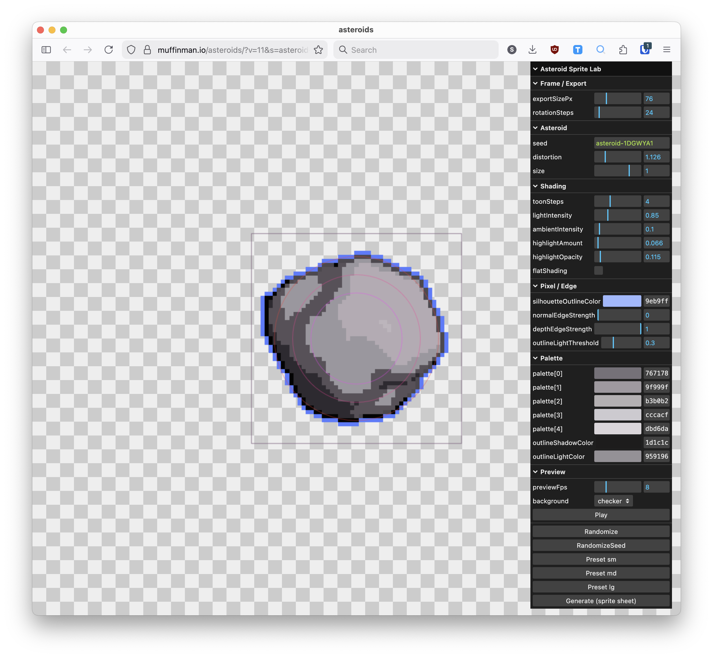

# Pixel art asteroid generator

A tool I used to generate pixel art animations for my game [SpaceDeck X](https://muffinman-io.itch.io/spacedeck-x). 

It uses simple procedural generation to deform the sphere into asteroids and then applies [this post processing effect](https://threejs.org/examples/webgl_postprocessing_pixel.html) to convert them to pixel art. Output is a sprite-sheet, which I then use directly in my game.

I used this app to test AI code generation. The 90% of the code is generated using AI (Codex App). It took me around an hour to get to the first fully working version. After that I iterated and changed things after seeing how they look in my game.

Please note that outputs are not AI generated, only the code. Images are purely procedural.

## Setup 

- Install node v24.3.0
- Install dependencies `npm install`
- Run local server `npm start`
